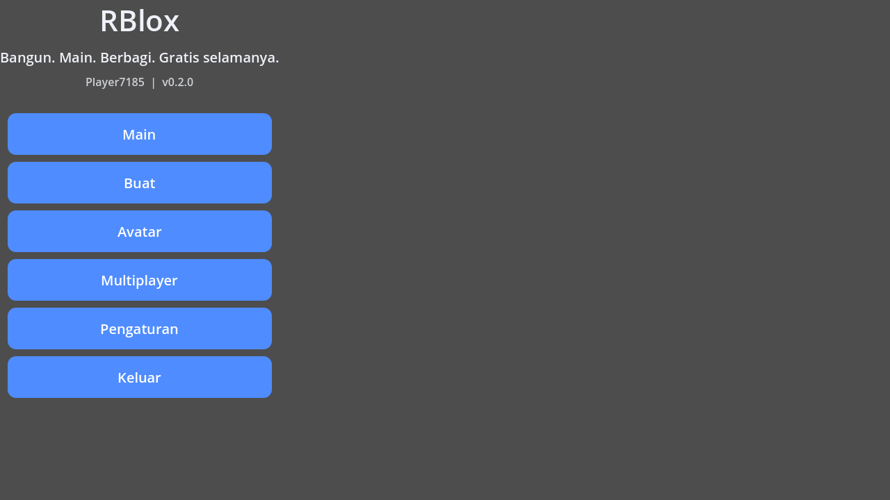
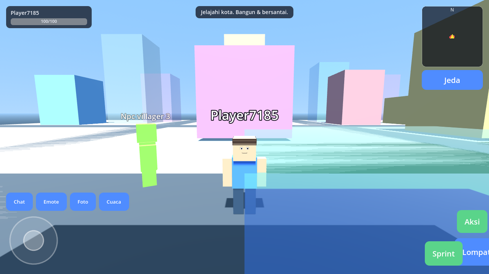

# RBlox — Sandbox 3D Gratis untuk Android

[](https://github.com/SecretArrow/RBlox/actions/workflows/build.yml)

**RBlox** adalah game sandbox 3D bergaya blocky (mirip Roblox) untuk **Android 7.0+ (API 24)**, dibangun dengan **Godot 4.4**.

> 100% GRATIS — tanpa iklan, tanpa in-app purchase, tanpa lootbox. Semua item kosmetik terbuka sejak awal. Tidak wajib registrasi; data tersimpan lokal di perangkat.

## Pratinjau

| Menu Utama | Gameplay (Kota) |
|---|---|
|  |  |


## Fitur

| Kategori | Detail |
|---|---|
| **Avatar** | Karakter blocky 3D + editor lengkap: 52 item kosmetik (topi, rambut, wajah, baju, celana, aksesori, sayap, tas, senjata), 8 preset, palet warna, ekspresi wajah prosedural |
| **Offline / Single Player** | 10 template world bawaan: Obby, Tycoon, Racing, Kota Roleplay, Survival, Horror, Bedwars, Hide & Seek, World Kosong, Adventure — dengan NPC bot, siklus siang-malam, cuaca, minimap, achievement offline, tutorial interaktif |
| **Multiplayer Lokal** | Host-client via **LAN/Hotspot** hingga 16 pemain (ENet port 24565) + auto-discovery room (UDP 24566), lobby, chat teks + quick emote, kick (host), reconnect otomatis, sinkronisasi posisi & blok. Bluetooth & WiFi Direct: arsitektur plugin siap (fase Alpha) |
| **Build Mode** | Tempatkan/hapus/putar blok (box, sphere, cylinder, wedge), 5 material, 24 warna, anchored/dynamic (fisika), undo-redo 50 langkah, terrain editor (naik/turun/rata/cat), maks 4000 blok |
| **Scripting** | Block coding visual (tap-based, 9 perintah) untuk pemula + mini scripting berbasis Expression untuk pengguna mahir |
| **Save/Share** | Simpan/muat/lanjutkan (resume state) world lokal, ekspor/impor file `.myworld` (JSON) untuk dibagikan |
| **UI/UX** | Tombol besar (≥48dp), Bahasa **Indonesia + English**, **Dark & Light mode**, kontrol sentuh (joystick + drag kamera) + gamepad Bluetooth |
| **Performa** | Renderer mobile Godot, target 60 FPS di RAM 3-4GB, APK < 300MB |

## Unduh APK (via GitHub Actions)

1. Buka tab **[Actions](../../actions/workflows/build.yml)** → pilih run terbaru → unduh artifact **RBlox-Android**.
2. Atau buka **[Releases](../../releases)**: pre-release `dev-build` diperbarui otomatis tiap push ke `main`; rilis stabil dibuat dari tag `v*`.
3. Install: izinkan "Install dari sumber tidak dikenal" di pengaturan Android.

> APK ditandatangani dengan **debug keystore** (hanya untuk testing). Rilis publik nanti memakai keystore dari GitHub Secrets — lihat `docs/CI_CD.md`.

## Kontrol

| Aksi | Sentuh | Keyboard | Gamepad |
|---|---|---|---|
| Gerak | Joystick kiri | WASD | Left stick |
| Kamera | Drag area kanan | — | — |
| Lompat | Tombol Lompat | Spasi | A |
| Sprint | Tombol Lari | Shift | LB |
| Aksi/Masuk kart | Tombol Aksi | E | X |
| Build mode | Tombol Bangun | B | — |
| Chat | Tombol Chat | T | — |
| Pause | Tombol Pause | Esc | — |

## Struktur Proyek

```
RBlox/
├── project.godot           # Konfigurasi Godot 4.4 (mobile renderer, landscape)
├── export_presets.cfg      # Android (gradle, minSdk 24 / targetSdk 34) + fallback
├── scenes/                 # 9 scene inti (root + script, UI dibangun programatik)
├── scripts/
│   ├── autoload/           # Settings, Locale, GameState, Saves, Net (facade)
│   ├── player/             # Player controller, kamera, touch controls
│   ├── avatar/             # Avatar builder + cosmetics DB
│   ├── build/              # Build manager, block library, terrain, coding
│   ├── multiplayer/        # LAN backend, lobby, chat, transport stubs
│   ├── world/              # Game orchestrator, templates, modes, NPC, kart
│   ├── ui/                 # Menu, HUD, editor, tutorial, toast, minimap
│   └── meta/               # Screenshot & utilitas
├── data/                   # cosmetics.json (52 item), locales (id/en)
├── android_plugins/        # Skeleton plugin Bluetooth (Alpha)
├── tools/                  # ci_autofix.py, sync_locales.py
├── docs/                   # ARCHITECTURE, ROADMAP, CI_CD, MULTIPLAYER
└── .github/workflows/      # build.yml + autofix.yml (CI/CD otomatis)
```

## Build dari Source

Tidak perlu build lokal — **push ke `main` dan GitHub Actions otomatis menghasilkan APK** (Godot headless + export templates, di-cache untuk kecepatan). Panduan lengkap: [`docs/CI_CD.md`](docs/CI_CD.md). Jika CI gagal, workflow **CI Auto-Fix** mencoba memperbaiki (format + locale) dan membuka issue bila butuh perbaikan manual.

## Dokumentasi Lanjutan

- [Arsitektur Kode](docs/ARCHITECTURE.md)
- [Rencana Pengembangan MVP → Alpha → v1.0](docs/ROADMAP.md)
- [Pipeline CI/CD](docs/CI_CD.md)
- [Protokol Multiplayer](docs/MULTIPLAYER.md)

## Lisensi

Kode proyek ini bebas digunakan dan dimodifikasi. "RBlox" tidak berafiliasi dengan Roblox Corporation.
